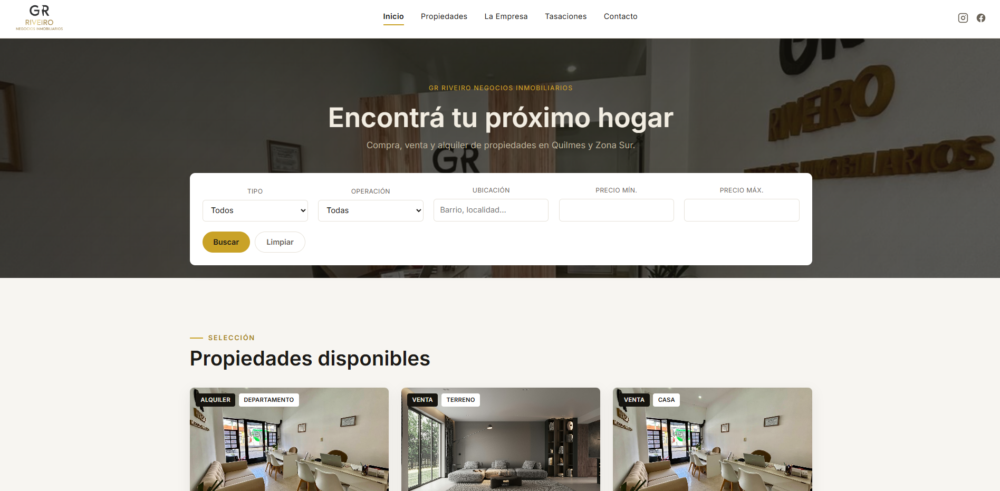
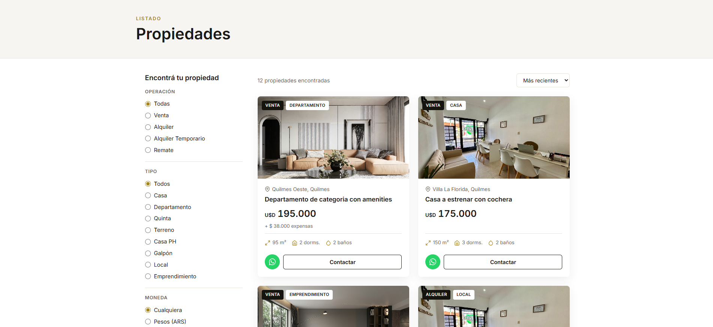
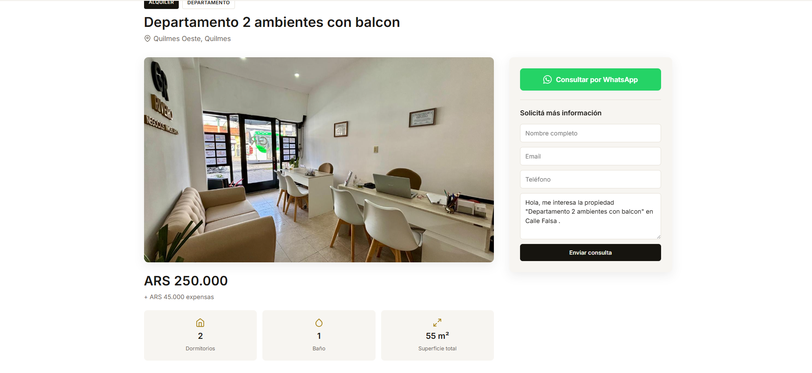
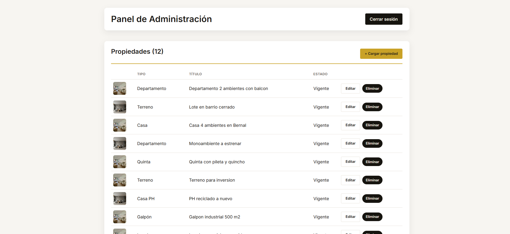

# GR Riveiro Negocios Inmobiliarios

Sitio web completo (público + panel de administración) para una inmobiliaria real de Quilmes, Zona Sur (Buenos Aires, Argentina). Full‑stack desde cero: backend en ASP.NET Core y frontend en Angular.


## Capturas

<!--
  Sacá capturas de las páginas y guardalas en docs/screenshots/ con estos nombres
  (podés usar el navegador con Ctrl+Shift+S o cualquier herramienta de captura):

    docs/screenshots/inicio.png
    docs/screenshots/propiedades.png
    docs/screenshots/detalle.png
    docs/screenshots/panel.png

  Apenas estén los archivos ahí, estas líneas ya las muestran solas.
-->

| Inicio | Propiedades |
|---|---|
|  |  |

| Detalle de propiedad | Panel de administración |
|---|---|
|  |  |

## Sobre el proyecto

GR Riveiro Negocios Inmobiliarios se dedica a la venta y alquiler de propiedades en Quilmes y Zona Sur. Este proyecto reemplaza su sitio anterior por uno hecho a medida: un sitio público donde cualquiera puede ver y filtrar propiedades y contactarse por WhatsApp o formulario, y un panel privado donde la administradora carga, edita y elimina propiedades, y recibe avisos por mail de cada consulta.

Se armó **desde cero**, definiendo el modelo de datos según los 8 tipos de propiedad reales que maneja la inmobiliaria (Casa, Departamento, Quinta, Terreno, Casa PH, Galpón, Local, Emprendimiento), cada uno con sus propios campos específicos.

## Funcionalidades

**Sitio público**
- Listado de propiedades con filtros (tipo, operación, moneda, ubicación, precio) y paginado.
- Ficha de cada propiedad: galería de fotos, mapa (OpenStreetMap), características, y formulario de contacto.
- Botón de WhatsApp con mensaje precargado, en cada propiedad y en el sitio en general.
- "Propiedades similares" calculadas automáticamente (mismo tipo/zona/operación/rango de precio).
- Formularios de Contacto y Tasación, con validación y envío de mail automático a la administradora.
- Diseño responsive, pensado para verse bien tanto en celular como en escritorio.

**Panel de administración**
- Login con usuario y contraseña (JWT).
- Alta, edición y baja de propiedades, con un formulario dinámico que cambia según el tipo elegido.
- Carga de fotos con reordenamiento por drag & drop (la primera foto queda como portada).
- Listado de consultas recibidas, con opción de marcarlas como leídas.

## Tecnologías

**Backend** — `backend/`
- ASP.NET Core 10 (Web API)
- Entity Framework Core 10 + SQLite (con herencia TPH para los 8 tipos de propiedad)
- Autenticación JWT + contraseñas hasheadas con BCrypt
- Envío de mails por SMTP

**Frontend** — `frontend/`
- Angular 22 (standalone components, Signals, nueva sintaxis de control de flujo)
- Angular CDK (drag & drop de fotos)
- TypeScript, SCSS

## Cómo correrlo en local

**Backend**
```bash
cd backend/Inmobiliaria.Api
dotnet user-secrets set "AdminSeed:Email" "tu-email@ejemplo.com"
dotnet user-secrets set "AdminSeed:Password" "una-contraseña"
dotnet ef database update
dotnet run --urls http://localhost:5080
```

**Frontend**
```bash
cd frontend
npm install
npx ng serve --port 4200
```

Después abrí `http://localhost:4200`. El panel de administración está en `/admin`.

## Autor

Hecho por [Ramiro Busto](https://ramirobusto.netlify.app/).
